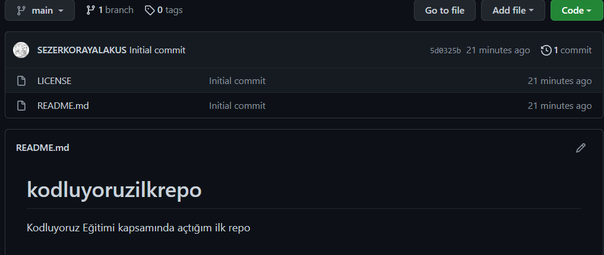

# Kodluyoruz Ilk Repo
Bu repo [Kodluyoruz](http:\\kodluyoruz.org) Front-End Eğitiminde oluşturduğumuz ilk repo. İçerisinde bir adet README dosyası, bir adat de index.html barındırıyor.



## Installation
Öncelikle projeyi clonelayın. (Buraya sizin reponuzdan aldığınız link gelecek)
```
https://github.com/SEZERKORAYALAKUS/kodluyoruzilkrepo.git
```

## Usage
Projeyi cloneladıktan sonra Visual Studio Code programında açınız.

Linux için:
```linux
cd kodluyoruzilkrepo
code .
```

## Contributing
Pull requestler kabul edilir. Büyük değişiklikler için, lütfen önce neyi değiştirmek istediğinizi tartışmak için konu açınız.

## License
[MIT](http:\\google.com)
